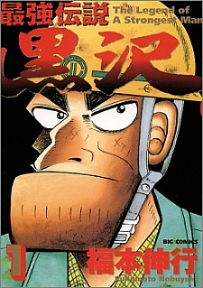
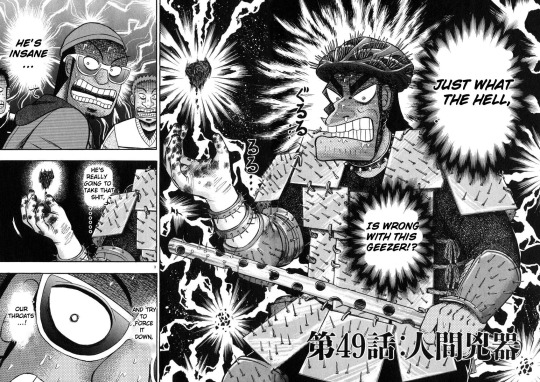
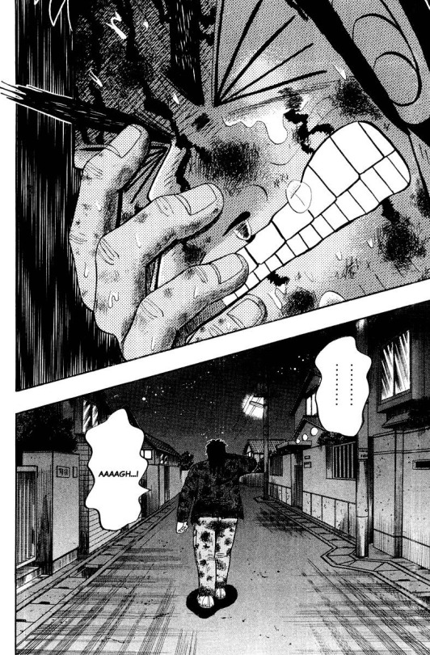
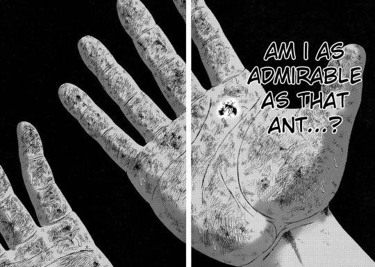

Just to let you all know, I started working out on May 2015. Since then, I’ve been actively running every other day and doing some light exercises such as push ups, sit ups, and bench presses in my room. It is October 2016 now. So you must be thinking that I am pretty strong right?

Well, I can barely do 1 pull up.

Nevertheless, this isn’t what I want to write about.

What I want to write about is Saikyou Densetsu Kurosawa by Fukumoto Nobuyuki (FKMT), which I finished reading. Similar to other FKMT’s works such as Kaiji, this manga is great at depicting the beauty of human ugliness, something that is almost unrivaled by other anime/manga works.

Saikyou Densetsu Kurosawa is about a 44 year old man who lives a dull unfulfilling life as a construction worker. No wife, no kids, he spends everyday trying to earn the respect of his coworkers, but always awkwardly fails.  And yet, he is also the strongest man in the world, not physically, but spiritually.

It is a pretty funny manga. Kurosawa is so pitiful that sometimes it is humorous. There are times where I had a chuckle at his insane antics or him being very perverted and “accidentally” bumping his head into women’s crotches in the swimming pool. What I love about Kurosawa as a character is that he is very multifaceted. He is a huge coward and yet he has great courage. He is weak to be beaten by middle schoolers and yet he is strong enough to fend off an army of punks. He is a very ugly character, as depicted by the simple crude drawings from FKMT. His crooked nose, his strong jawline, and angry eyes. He is not what you imagine to be ideal as a main character. But yet, I grow really attached to this character through his lows and highs. Really, there is some badassness to be held in the ugliness of Kurosawa.

I think it’s safe to say that we all have, or will, experience failure in our lifetime. There will be times when we doubt ourselves and our choices in life. “Did I really made the right decision back then?” “Should I have tried harder?” As time past us by, the worries and anxieties that we accumulate like pebbles would start to weigh on our minds like a boulder. And before we know it, we are left beneath a mountain’s shadow to test our resolve to climb over it.

Such is the case of our hero, Kurosawa. He is pathetic. He has moments where he is wimpy, doubts himself, and is overall a socially awkward person who is misunderstood a lot. I frankly had a few times where I received second-hand embarrassment from reading his drunken actions. Kurosawa’s life is nothing glamorous, it is downright pitiful to the point where he is beaten by kids with his pants off.

Despite being oppressed by social norms, Kurosawa still fights on. Literally. Throughout the manga, Kurosawa gets his revenge on students and punks that look down upon him. And the way he executes his plans are at times, really jaw dropping with a dosage of hype. I even dare to group Kurosawa with other badasses throughout the history of manga/anime. He is just that cool. But before I get sidetracked, the point of Kurosawa as a character and the whole theme of the manga isn’t the fact that he wins battles against kids three times younger than his age. In fact, winning the battles at all does not mean a thing for Kurosawa. Because what he is truly fighting against is himself. The battles, to me, are more of a metaphorical struggle of Kurosawa’s inner incapability. Like I said before, Kurosawa is ugly as a person on the outside, and also in the inside. He lived a whole life of regret and shame. Many chapters were served to get deep into Kurosawa’s head to know what kind of self deprecating man he truly is.

But despite all that, the beauty of Kurosawa lies in his resolve and “samurai spirit” to strive, no matter how meaningless his actions might seem. He serves to remind us that despite being dealt a bad hand in life, your social status is not what matters in the end, but rather your human dignity. This is something that I really appreciate from Saikyou Densetsu Kurosawa. In this age of anime, some viewers like to self insert themselves into the ideal main character that seems perfectly normal, yet has great feats and accomplishments and overpowered skills. That is fine and all, I do that too sometimes. But it isn’t right to perceive oneself as perfect, because there is no such thing as perfection in a human being. We are all flawed people.

The importance of Kurosawa is that there is still some greatness in small and meaningless accomplishments. Because what really matters isn’t the victory or the loss, but whether or not you truly stand up for what you believed in with your determination.

And such is true strength